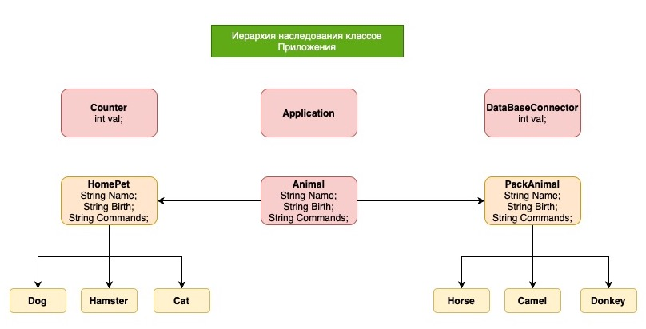
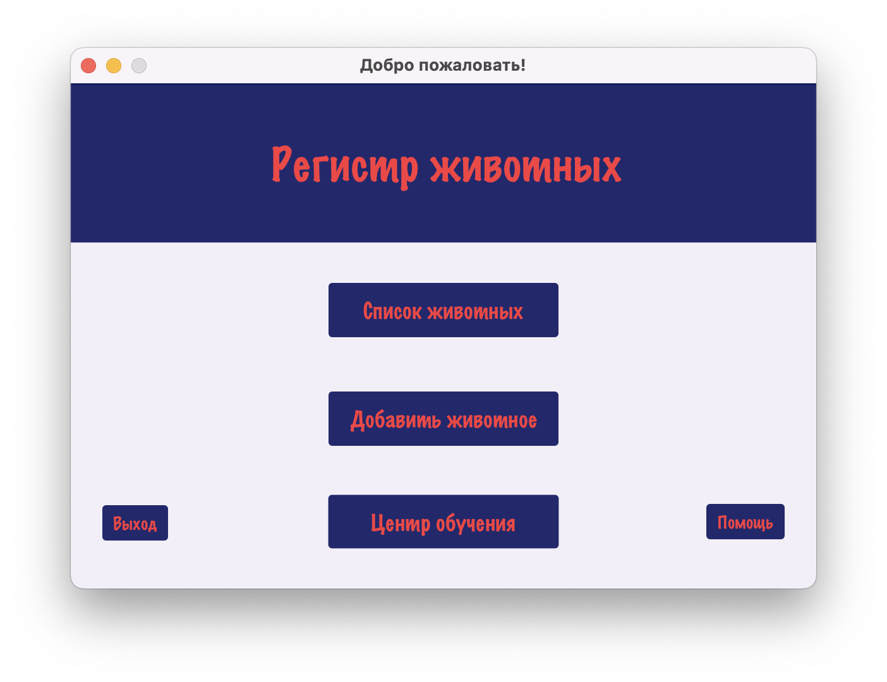
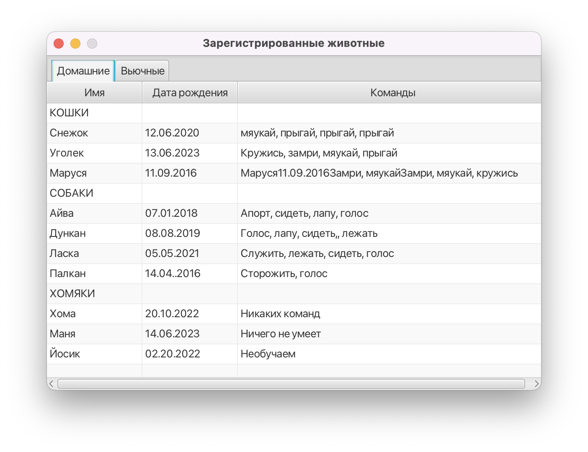
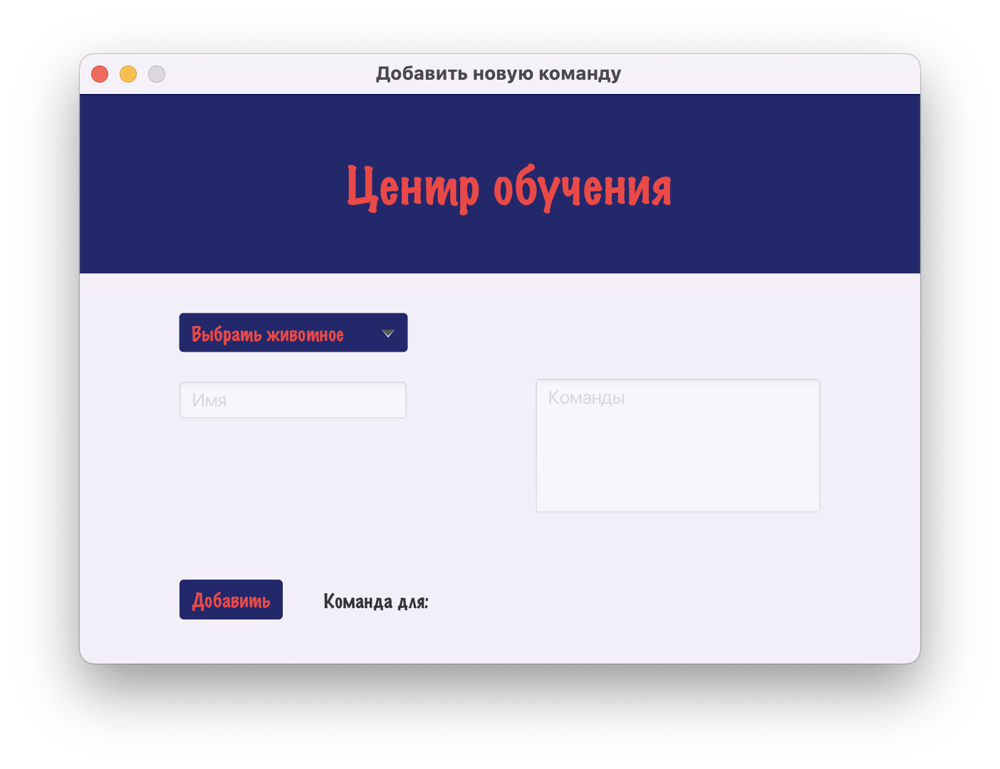
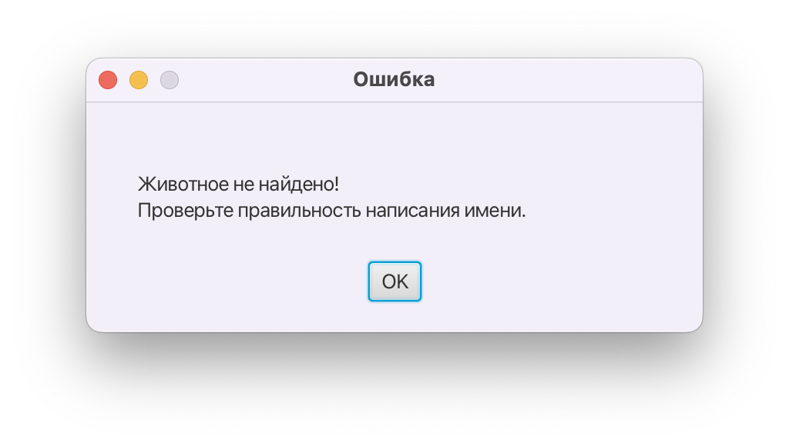

# Приложение-клиент для сервера базы данных приюта для животных

## Навигатор:
### 1. Описание Приложения  
### 2. Иерархия классов Приложения  
### 3. Функционал Приложения  
### 4. Обрабатываемые ошибки
## Описание

  
Приложение для управления Базой Данных приюта для животных является десктопным приложением, устанавливаемым на ПК. Оно 
позволяет наглядно отображать данные, а также управляеть ими посредством интеркативного интерфейса.  
Приложение основано на принципе клиент-серверной архитектуре. Все данные хранятся в виде значений в таблицах Базы 
Данных, расположенной на Сервере (удаленном или локальном). При выполненни операций (добавление новых животных, их 
обучение и проч.) Приложение посылает на Сервер соответствующий запрос и считывает ответ.

## Иерархия клсоов

Иерархия классов и их наследование представлены на рисунке ниже:  
  
Класс *Application* - основной класс Приложения (инициализирует Приложение).  
Класс *Counter* - счетчик для успешных операций (добавление нового животного).  
Класс *DataBaseConnector* - класс, отвечающий за все операции, связанные с работой с Сервером Базы Данных.

Класс *Animal* - супер-класс для описания сущностей (втипов и видов животных), информация о которых хранится в Базе Данных.  
Ему наследуют два подкласса *HomePet* и *PackAnimal* - домашнее и вьючное животное. Данные классы являются родительскими
для подклассов *Dog*, *Hamster*, *Cat*, *Horse*, *Camel*, *Donkey*.

## Функционал

В Приложении доступны 3 основных функции: вывод списка всех зарегистрированных животных, внесение в Базу Данных нового 
животного и внесение новых команд, котрым обучено животное.  
  
1. При нажатии на кнопку *Список животных* на экран выводится список животных, зарегистрированных в Базе Данных.
Список разделен на 2 вкладки: Домашние ии Вьючные животные. В нем отображается информация о животных: Имя, Дата
Рождения и список Команд.  

2. Кнопка *Добавить животное* открывает новое окно для ввода информации о животном, котрое вносится в Базу Данных.  
Пользователю необходимо выбрать вид животного и ввести следующую информацию: Имя животного, Дата Рождения и список Команд.  
  
Приложение оповестит Пользователя об успешном добавлении животного. А также отобразит показание счетчика успешных операций.
3. В случае, если необходимо добавить новые команды для животного, это можно сделать, открыв новое окно нажатием на
кнопку *Центр обучения*.  
Пользотвалею необходимо выбрать вид животного и ввести его Имя и список Команды, которые требуется добавить.
  
Приложение оповестит Пользователя об успешном добавлении команд.

## Обрабатываемые ошибки

Приложение разрабоано таким образом, чтобы минимизировать возникновение ошибок. Тем не менее Пользователь будет извещен 
о 2 главных ошибках:  
1. Отсутствие подключения к Серверу.  
В этом случае Приложение оповестит Пользователя и не будет реагировать на нажатие на кнопку *Начать* в стартовом окне.  

2. Ошибка при добавлении новых команд для животного.  
В этом случае Приложение известит Пользователя. Возможные причины ошибки: животное с указанным именем отсутствует в 
Базе Данных или имя введено с ошибкой.  
